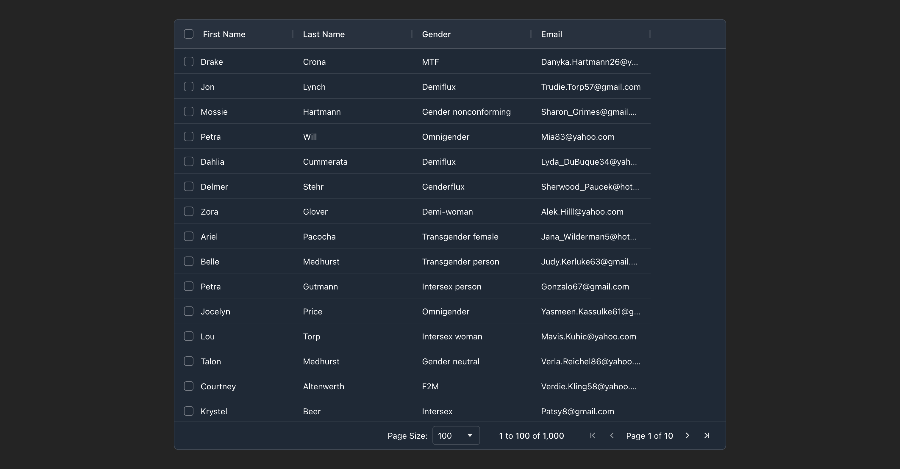

# ag-grid-example

[](https://github.com/prettier/prettier)
[](https://github.com/malcodeman/ag-grid-example/blob/master/LICENSE)

AG Grid example.



## Getting started

```
git clone https://github.com/malcodeman/ag-grid-example.git
cd ag-grid-example
npm install
npm run dev
```

## License

[MIT](./LICENSE)
